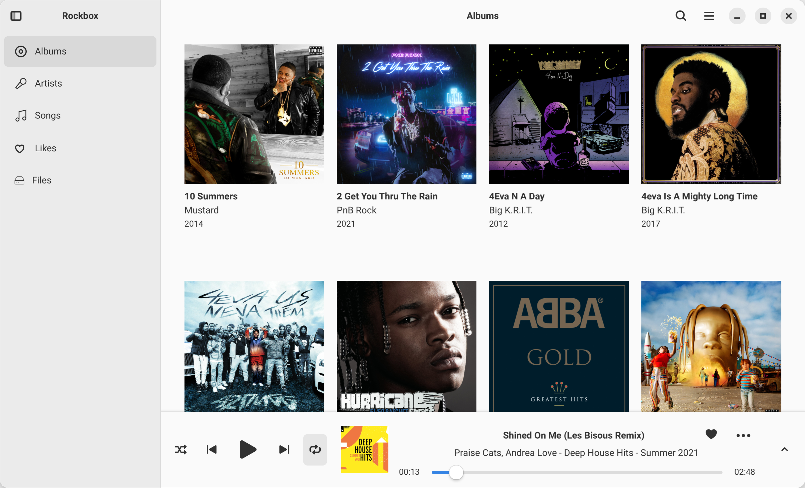
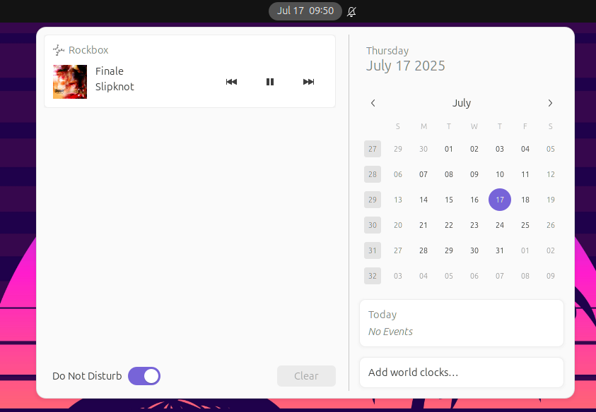
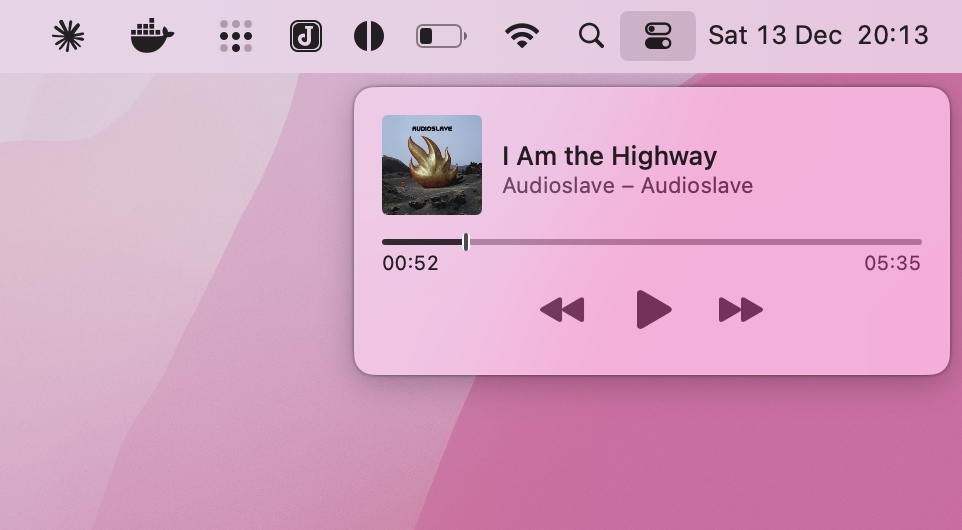
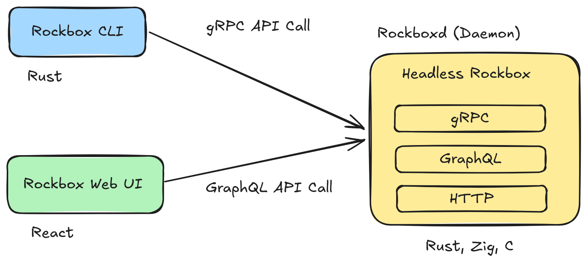
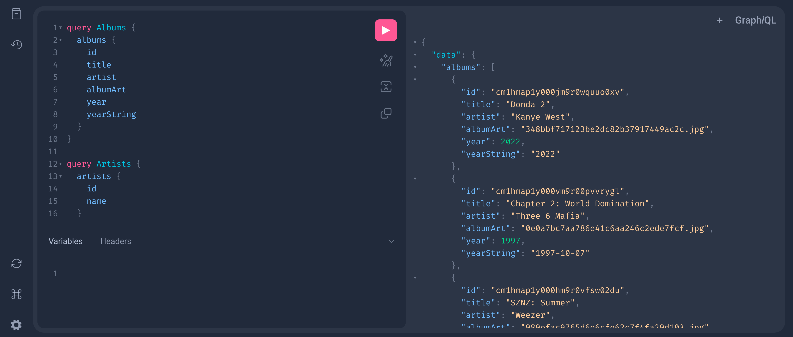
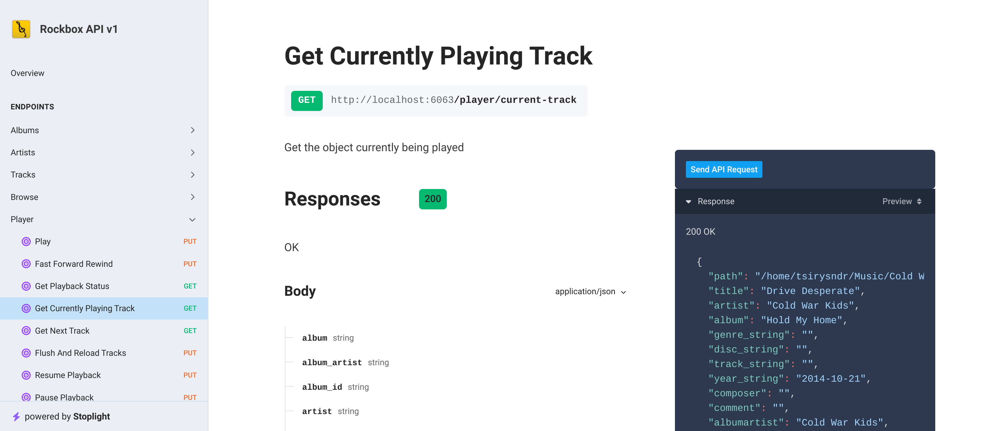
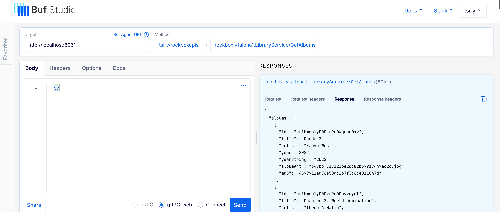

<div>
  
</div>

# Rockbox Zig 🎵 ⚡

[](./LICENSE)
[](https://github.com/tsirysndr/rockbox-zig/actions/workflows/ci.yml)
[](https://hub.docker.com/r/tsiry/rockbox)

[](https://discord.gg/tXPrgcPKSt)
[](https://master--670ceec25af685dcdc87c0df.chromatic.com/?path=/story/components-albums--default)



A modern take on the [Rockbox](https://www.rockbox.org) open source high quality
audio player with enhancements in Zig and Rust. This project offers:

- gRPC & GraphQL APIs for seamless interaction and control
- Chromecast support for streaming to your TV
- [MPD](https://mpd.readthedocs.io/en/stable/protocol.html) server for
  compatibility with existing clients
- [MPRIS](https://specifications.freedesktop.org/mpris-spec/) support for
  desktop integration
- TypeScript support for building powerful extensions

Take advantage of modern tooling while preserving the core functionality of
Rockbox.

> [!NOTE] **🐲 It is a work in progress and is not yet ready for use. 🏗️🚧**






## ✨ Features

- [x] Zig Build System
- [x] Rockbox API FFI for Rust
- [x] [gRPC API](https://buf.build/tsiry/rockboxapis/docs/main:rockbox.v1alpha1)
- [x] GraphQL API
- [x] HTTP API
- [x] Web Client (React)
- [x] Fast search engine, built with
      [Tantivy](https://github.com/quickwit-oss/tantivy)
- [x] Desktop Client (Electron/Gtk)
- [x] Rockbox REPL
- [x] Terminal Client (TUI)
- [x] Systemd service
- [x] Gapless playback and crossfading
- [x] Navigate music by folders or tag database
- [x] Supports over 20 sound codecs: MP3, OGG, WAV, FLAC and many more
- [ ] Android Library
- [ ] Mobile version (React Native)
- [ ] Stream from Youtube (audio only)
- [ ] Stream from Spotify
- [ ] Stream from Tidal
- [x] Stream to Chromecast
- [ ] Stream to Kodi
- [ ] TuneIn Radio
- [x] MPD Server
- [x] MPRIS
- [ ] UPnP/DLNA
- [ ] Airplay
- [ ] TypeScript ([Deno](https://deno.com)) API (for writing plugins)
- [ ] Wasm extensions

## 🚚 Installation

### Ubuntu/Debian

```sh
echo "deb [trusted=yes] https://apt.fury.io/tsiry/ /" | sudo tee /etc/apt/sources.list.d/fury.list
sudo apt-get update
sudo apt-get install rockbox
```

### Fedora

Add the following to `/etc/yum.repos.d/fury.repo`:

```
[fury]
name=Gemfury Private Repo
baseurl=https://yum.fury.io/tsiry/
enabled=1
gpgcheck=0
```

Then run:

```sh
dnf install rockbox
```

### Arch Linux

```sh
paru -S rockbox-zig-bin
```

### Bash / Linux / MacOS

```sh
curl -fsSL https://raw.githubusercontent.com/tsirysndr/rockbox-zig/HEAD/install.sh | bash
```

## 📦 Downloads

- `Linux`: intel:
  [rockbox_2025.12.23_x86_64-linux.tar.gz](https://github.com/tsirysndr/rockbox-zig/releases/download/2025.12.23/rockbox_2025.12.23_x86_64-linux.tar.gz)
  arm64:
  [rockbox_2025.12.23_aarch64-linux.tar.gz](https://github.com/tsirysndr/rockbox-zig/releases/download/2025.12.23/rockbox_2025.12.23_aarch64-linux.tar.gz)
- `macOS`: intel:
  [rockbox-2025.12.23-x86_64.pkg](https://github.com/tsirysndr/rockbox-zig/releases/download/2025.12.23/rockbox-2025.12.23-x86_64.pkg)
  arm64:
  [rockbox-2025.12.23-aarch64.pkg](https://github.com/tsirysndr/rockbox-zig/releases/download/2025.12.23/rockbox-2025.12.23-aarch64.pkg)

## 🧙‍♂️ Systemd Service

Rockbox daemon can be started as a systemd service. To enable and start the
service, run the following command:

```sh
rockbox service install
```

To disable and stop the service, run the following command:

```sh
rockbox service uninstall
```

To check the status of the service, run the following command:

```sh
rockbox service status
```


## Compiling from Source

Run the following commands to build the project:

Before building the project, you need to install the necessary dependencies for
your operating system.

### On Ubuntu/Debian

```bash
sudo apt-get install libsdl2-dev libfreetype6-dev libunwind-dev zip protobuf-compiler cmake
```

### On Fedora40/41:

```sh
sudo dnf install SDL2-devel freetype-devel libunwind-devel zip protobuf-compiler cmake
```

### Build Instructions

1. Clone the repository

```sh
git clone https://github.com/tsirysndr/rockbox-zig.git
git submodule update --init --recursive
```

2. Navigate to the project directory

```sh
cd rockbox-zig
```

3. Build the webui

```sh
cd webui/rockbox
deno install
deno run build
```

4. Run the following command to build the project

```sh
mkdir -p build-lib && cd build-lib
../tools/configure --target=sdlapp --type=N --lcdwidth=320 --lcdheight=240 --prefix=/usr/local && cp ../autoconf/autoconf.h .
make zig
```

### Build GUI (Gtk4)

```sh
sudo apt-get install flatpak
flatpak remote-add --if-not-exists --user flathub https://dl.flathub.org/repo/flathub.flatpakrepo
flatpak install --user flathub org.flatpak.Builder
flatpak install --user flathub org.gnome.Sdk/x86_64/47
flatpak install --user flathub org.gnome.Platform/x86_64/47
flatpak install --user org.freedesktop.Sdk.Extension.rust-stable
flatpak install --user org.freedesktop.Sdk.Extension.llvm18
cd gtk
flatpak run org.flatpak.Builder --user --disable-rofiles-fuse --repo=repo flatpak_app build-aux/io.github.tsirysndr.Rockbox.json --force-clean
flatpak run org.flatpak.Builder --run flatpak_app build-aux/io.github.tsirysndr.Rockbox.json rockbox-gtk
```

## 🧑‍🔬 Architecture



## 📚 GraphQL API

Open [http://localhost:6062/graphiql](http://localhost:6062/graphiql) in your
browser.

<p style="margin-top: 20px; margin-bottom: 20px;">
 
</p>

## 📚 HTTP API

Open [http://localhost:6063](http://localhost:6063) in your browser.

<p style="margin-top: 20px; margin-bottom: 20px;">
 
</p>

## 📚 gRPC API

[https://buf.build/tsiry/rockboxapis/docs/main:rockbox.v1alpha1](https://buf.build/tsiry/rockboxapis/docs/main:rockbox.v1alpha1)

Try Rockbox gRPC API using
[Buf Studio](https://buf.build/studio/tsiry/rockboxapis/rockbox.v1alpha1.LibraryService/GetAlbums?target=http%3A%2F%2Flocalhost%3A6061&selectedProtocol=grpc-web).

<p style="margin-top: 20px; margin-bottom: 20px;">
 
</p>
