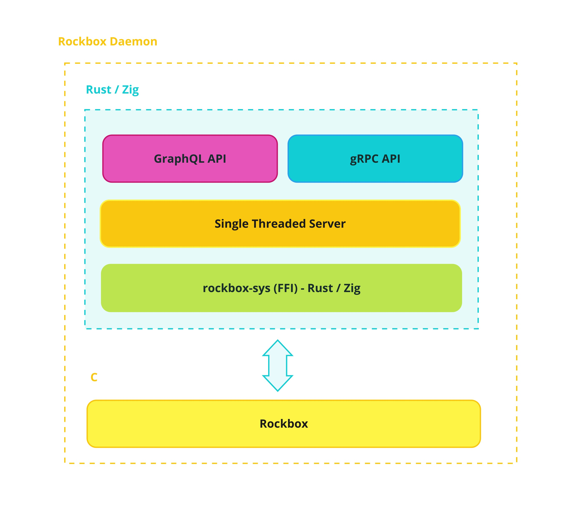

<div>
  
  
</div>

# Rockbox Zig 🎵 ⚡

[](./LICENSE)
[](https://github.com/tsirysndr/rockbox-zig/actions/workflows/ci.yml)
[](https://hub.docker.com/repository/docker/tsiry/rockbox/general)


A modern take on the [Rockbox](https://www.rockbox.org) open-source firmware with enhancements in Zig and Rust. This project offers:

- gRPC & GraphQL APIs for seamless interaction and control
- TypeScript support for building powerful extensions

Take advantage of modern tooling while preserving the core functionality of Rockbox.

> [!NOTE]
**🐲 It is a work in progress and is not yet ready for use. 🏗️🚧**


## 🚀 Quickstart

To quickly get started, you can run the following docker command:
```sh
docker run \
    --device /dev/snd \
    --privileged \
    -p 6061:6061 -p 6062:6062 -p 6063:6063 \
    tsiry/rockbox:latest
```

Run the following commands to build the project:

```sh
sudo apt-get install libusb-dev libsdl1.2-dev libfreetype6-dev libunwind-dev zip protobuf-compiler
mkdir -p build && cd build
../tools/configure --target=sdlapp --type=N --lcdwidth=320 --lcdheight=240 --prefix=$HOME/.local
make zig
```

## ✨ Features

- [x] Zig Build System
- [x] Rockbox API FFI for Rust
- [x] [gRPC API](https://buf.build/tsiry/rockboxapis/docs/main:rockbox.v1alpha1)
- [x] GraphQL API
- [ ] Web Client (React)
- [ ] Desktop Client (Electron/Gtk)
- [ ] Terminal Client (TUI)
- [ ] Android Library
- [ ] Mobile version (React Native)
- [ ] Stream from Youtube (audio only)
- [ ] Stream from Spotify
- [ ] Stream from Tidal
- [ ] Stream to Chromecast
- [ ] TuneIn Radio
- [ ] MPD Server
- [ ] MPRIS
- [ ] Upnp Player
- [ ] Airplay
- [ ] TypeScript ([Deno](https://deno.com)) API (for writing plugins)
- [ ] Wasm extensions

## 🧑‍🔬 Architecture


  
