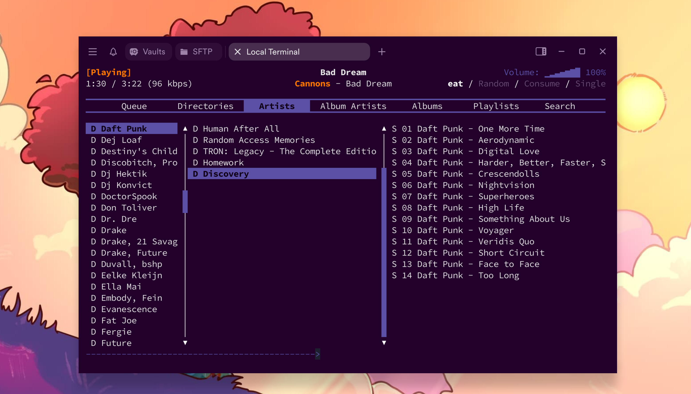
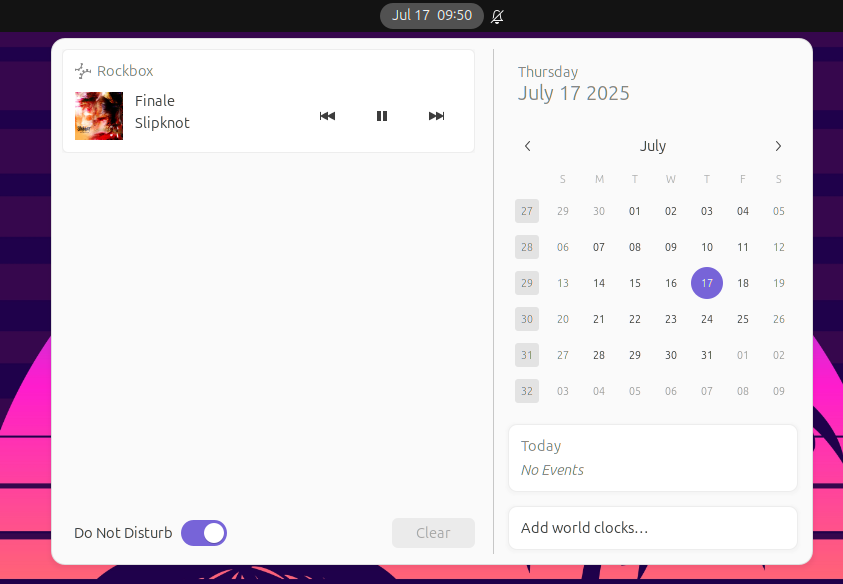
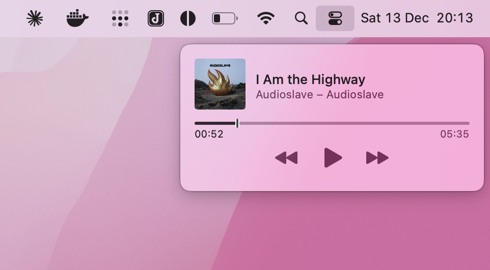
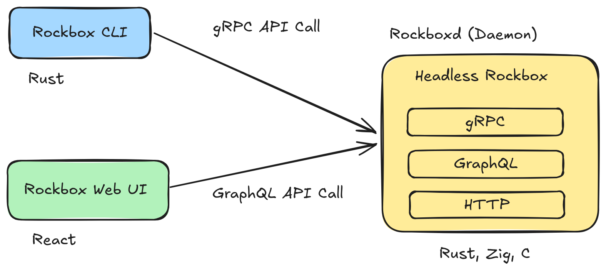
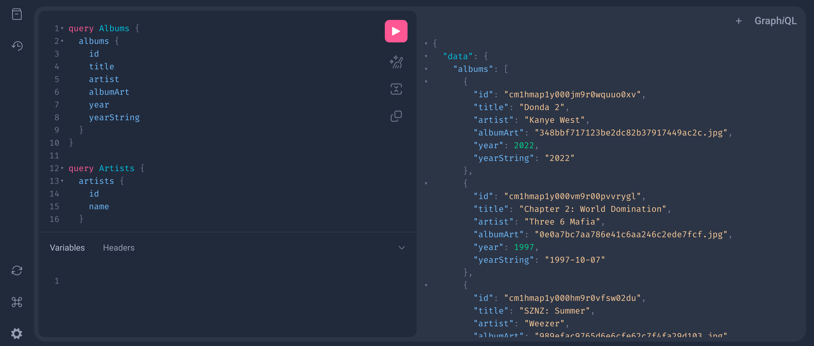
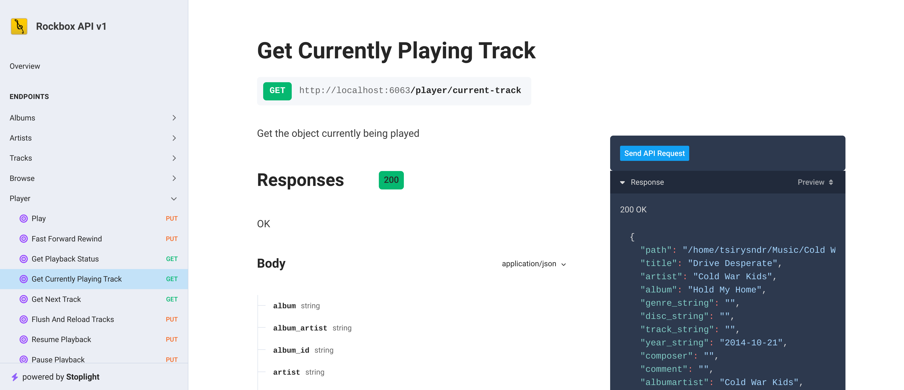
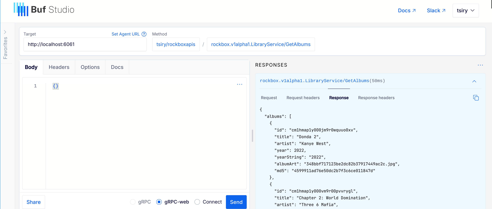

<div>
  
</div>

# Rockbox Zig 🎵 ⚡

[](./LICENSE)
[](https://github.com/tsirysndr/rockbox-zig/actions/workflows/ci.yml)
[](https://hub.docker.com/r/tsiry/rockbox)

[](https://discord.gg/tXPrgcPKSt)
[](https://master--670ceec25af685dcdc87c0df.chromatic.com/?path=/story/components-albums--default)


A modern take on the [Rockbox](https://www.rockbox.org) open source audio
player, extended with Rust and Zig. Rockbox Zig exposes the full Rockbox audio
engine — gapless playback, DSP, 20+ codecs, tag database — through gRPC,
GraphQL, HTTP, and MPD APIs, and adds multi-room output via AirPlay, Snapcast,
and Squeezelite.






---

## ✨ Features

### Audio output
- [x] Built-in SDL audio
- [x] AirPlay (RAOP) — single or multi-room fan-out to Apple TV, HomePod, Airport Express, shairport-sync
- [x] Snapcast (FIFO/pipe) — synchronised multi-room via snapserver
- [x] Squeezelite (Slim Protocol + HTTP broadcast) — synchronised multi-room
- [x] Chromecast
- [x] Gapless playback and crossfading
- [x] Supports 20+ codecs: MP3, OGG, FLAC, WAV, AAC, Opus, and more

### APIs & integrations
- [x] [gRPC API](https://buf.build/tsiry/rockboxapis/docs/main:rockbox.v1alpha1)
- [x] GraphQL API
- [x] HTTP REST API
- [x] [MPD](https://mpd.readthedocs.io/en/stable/protocol.html) server — compatible with all MPD clients
- [x] [MPRIS](https://specifications.freedesktop.org/mpris-spec/) — desktop media key and taskbar integration
- [x] Fast search powered by [Typesense](https://typesense.org)
- [x] Navigate by folders or tag database
- [x] UPnP/DLNA

### Clients
- [x] Web client (React)
- [x] Desktop client (Native MacOS / GPUI / GTK4)
- [x] Terminal client (TUI)
- [x] Rockbox REPL

### Planned
- [ ] Android library
- [ ] Mobile app (React Native)
- [ ] Stream from YouTube / Spotify / Tidal
- [ ] TuneIn Radio
- [ ] Kodi output
- [ ] TypeScript ([Deno](https://deno.com)) plugin API
- [ ] Wasm extensions

---

## 🚀 Quick Start

1. **Install** (see [Installation](#-installation) below).

2. **Create `~/.config/rockbox.org/settings.toml`**:

```toml
music_dir    = "/path/to/your/Music"
audio_output = "builtin"   # SDL audio — see Audio Output for other options
playlist_shuffle = false
repeat_mode = 1
bass = 0
treble = 0
bass_cutoff = 0
treble_cutoff = 0
crossfade = 5
fade_on_stop = false
fade_in_delay = 2
fade_in_duration = 7
fade_out_delay = 4
fade_out_duration = 0
fade_out_mixmode = 2
balance = 0
stereo_width = 100
stereosw_mode = 0
surround_enabled = 0
surround_balance = 0
surround_fx1 = 0
surround_fx2 = 0
party_mode = true
channel_config = 0
player_name = ""
eq_enabled = true

[[eq_band_settings]]
cutoff = 0
q = 64
gain = 10

[[eq_band_settings]]
cutoff = 3
q = 125
gain = 10

[[eq_band_settings]]
cutoff = 19
q = 250
gain = 10

[[eq_band_settings]]
cutoff = 5
q = 500
gain = 10

[[eq_band_settings]]
cutoff = -16
q = 1000
gain = 10

[[eq_band_settings]]
cutoff = -66
q = 2000
gain = 10

[[eq_band_settings]]
cutoff = -31
q = 4000
gain = 10

[[eq_band_settings]]
cutoff = 9
q = 8000
gain = 10

[[eq_band_settings]]
cutoff = 32
q = 16000
gain = 7

[[eq_band_settings]]
cutoff = 34
q = 0
gain = 0

[replaygain_settings]
noclip = true
type = 0
preamp = 0

[compressor_settings]
threshold = -24
makeup_gain = 0
ratio = 4
knee = 1
release_time = 300
attack_time = 5
```

3. **Start Rockbox**:

```sh
rockbox
```

4. **Open the web UI** at [http://localhost:6062/graphiql](http://localhost:6062) or connect any MPD client to `localhost:6600`.

---

## 🔌 Ports

| Service                               | Default port | Protocol        |
|---------------------------------------|--------------|-----------------|
| gRPC                                  | 6061         | gRPC / gRPC-Web |
| GraphQL + Web UI                      | 6062         | HTTP            |
| HTTP REST API                         | 6063         | HTTP            |
| MPD server                            | 6600         | MPD protocol    |
| Slim Protocol (squeezelite)           | 3483         | TCP             |
| HTTP PCM stream (squeezelite)         | 9999         | HTTP            |
| Chromecast WAV stream                 | 7881         | HTTP            |
| UPnP Media Server (ContentDirectory)  | 7878         | HTTP / SSDP     |
| UPnP WAV broadcast (PCM sink)         | 7879         | HTTP            |
| UPnP MediaRenderer (AVTransport)      | 7880         | HTTP / SSDP     |

---

## ⚙️ Audio Output Configuration

Rockbox reads `~/.config/rockbox.org/settings.toml` at startup.
`music_dir` is always required. `audio_output` defaults to `"builtin"` if
omitted.

### Built-in SDL — default

```toml
music_dir    = "/path/to/Music"
audio_output = "builtin"
```

Uses SDL2 audio — plays through the OS default device. No extra setup needed.

### Snapcast (FIFO / pipe)

```toml
music_dir    = "/path/to/Music"
audio_output = "fifo"
fifo_path    = "/tmp/snapfifo"   # named FIFO for snapserver; use "-" for stdout
```

Writes raw **S16LE stereo 44100 Hz** PCM to a named FIFO. Feed it into
[Snapcast](https://github.com/badaix/snapcast) for synchronised multi-room
playback:

```ini
# /etc/snapserver.conf  (or /usr/local/etc/snapserver.conf on macOS)
[stream]
source = pipe:///tmp/snapfifo?name=default&sampleformat=44100:16:2
```

> **Startup order**: start `rockboxd` before `snapserver`. Rockbox holds a
> permanent write reference on the FIFO so snapserver never sees a premature
> EOF between tracks.

Pipe to any PCM consumer with `fifo_path = "-"`:

```sh
rockboxd | ffplay -f s16le -ar 44100 -ac 2 -
```

### AirPlay (RAOP) — single or multi-room

Single receiver:

```toml
music_dir    = "/path/to/Music"
audio_output = "airplay"
airplay_host = "192.168.1.50"   # IP of the AirPlay receiver
airplay_port = 5000             # optional, default 5000
```

Multi-room (fan-out to N receivers simultaneously):

```toml
music_dir    = "/path/to/Music"
audio_output = "airplay"

[[airplay_receivers]]
host = "192.168.1.50"   # living room
port = 5000             # optional, default 5000

[[airplay_receivers]]
host = "192.168.1.51"   # bedroom
# port defaults to 5000
```

Streams ALAC-encoded audio over RTP to any RAOP-compatible receiver — Apple
TV, HomePod, Airport Express, or
[shairport-sync](https://github.com/mikebrady/shairport-sync). All receivers
share the same `initial_rtptime`, so RTP-level playback synchronisation is
within one frame (~8 ms) across the LAN.

### Squeezelite (Slim Protocol — multi-room)

```toml
music_dir             = "/path/to/Music"
audio_output          = "squeezelite"
squeezelite_port      = 3483   # Slim Protocol TCP port, default 3483
squeezelite_http_port = 9999   # HTTP PCM broadcast port, default 9999
```

Rockbox acts as a minimal Logitech Media Server. Any number of
[squeezelite](https://github.com/ralph-irving/squeezelite) clients can connect
simultaneously; Rockbox sends a `sync` packet to every client once per second
so they all align to the same playback clock:

```sh
squeezelite -s localhost -n "Living Room"
squeezelite -s localhost -n "Kitchen"
squeezelite -s localhost -n "Bedroom"
```

Select a specific output device:

```sh
squeezelite -s localhost -l              # list available devices
squeezelite -s localhost -o ""           # system default
squeezelite -s localhost -o "Built-in Output"
```

### Chromecast

```toml
music_dir            = "/path/to/Music"
audio_output         = "chromecast"
chromecast_host      = "192.168.1.60"  # LAN IP of the target Chromecast
chromecast_port      = 8009            # optional, default 8009 (Cast protocol)
chromecast_http_port = 7881            # optional, default 7881 (WAV HTTP stream)
```

Rockbox streams audio to any Google Cast-compatible device — Google Home,
Chromecast Audio, Chromecast with Google TV, Nest Hub, or third-party Cast
receivers. It uses two channels simultaneously:

- **Cast protocol** (TCP 8009, TLS + Protobuf) — sends playback commands and
  tells the device where to fetch the audio stream.
- **WAV over HTTP** (port 7881) — serves a live `audio/wav` stream with a
  finite `Content-Length` so the Chromecast can show a progress bar and
  auto-advance the queue at track boundaries.

Track metadata (title, artist, album, duration) and album art are pushed to the
device on every track change. Chromecast devices on the LAN are also discovered
automatically via mDNS (`_googlecast._tcp.local.`) and appear in the UI device
picker; connecting through the picker starts the Cast session on demand without
requiring `audio_output = "chromecast"` in the config file.

> **Network requirement**: the Chromecast device must be able to reach port 7881
> on the machine running rockboxd. If rockboxd is inside a VM or container,
> forward that port to the host.

See [`crates/chromecast/README.md`](crates/chromecast/README.md) for a detailed
description of the architecture, protocols, and FFI surface.

### UPnP / DLNA

Rockbox has three independent UPnP/DLNA modes that can be combined freely.

#### PCM sink — stream live audio to a UPnP renderer (Kodi, VLC, …)

```toml
music_dir          = "/path/to/Music"
audio_output       = "upnp"

# AVTransport controlURL of the target renderer (required for metadata push)
upnp_renderer_url  = "http://192.168.1.x:7777/AVTransport/control"

# Port for the WAV HTTP broadcast server (default: 7879)
upnp_http_port     = 7879
```

Rockbox encodes live PCM as a continuous WAV-over-HTTP stream and commands the
renderer to play it via AVTransport SOAP. Track metadata (title, artist, album,
album art, duration) is sent as DIDL-Lite XML in `SetAVTransportURI` and
auto-refreshed on every track change so the renderer's "Now Playing" display
stays accurate.

> **Finding `upnp_renderer_url`**: start `rockboxd` with `RUST_LOG=info` — it
> scans the LAN on startup and logs `upnp scan: found renderer "…" av=http://…`
> for every discovered renderer.

#### Media Server — expose library to control points (BubbleUPnP, Kodi, …)

```toml
upnp_server_enabled = true
upnp_server_port    = 7878        # default
upnp_friendly_name  = "Rockbox"  # name shown in apps
```

Starts a ContentDirectory service so control points can browse artists, albums,
and tracks and pull audio directly from Rockbox.

#### MediaRenderer — let control points push media to Rockbox

```toml
upnp_renderer_enabled = true
upnp_renderer_port    = 7880        # default
upnp_friendly_name    = "Rockbox"
```

Rockbox registers as a `MediaRenderer:1`. Any DLNA control point (BubbleUPnP,
Foobar2000, etc.) can push a URI to Rockbox and control playback remotely.
Incoming DIDL-Lite metadata (title, artist, album, album art, duration) is
parsed and displayed.

#### All UPnP settings

| Key                        | Default      | Description                                    |
|----------------------------|--------------|------------------------------------------------|
| `audio_output = "upnp"`    | —            | Enable the PCM → WAV streaming sink            |
| `upnp_renderer_url`        | —            | AVTransport controlURL of the target renderer  |
| `upnp_http_port`           | `7879`       | WAV broadcast HTTP port                        |
| `upnp_server_enabled`      | `false`      | Start the ContentDirectory media server        |
| `upnp_server_port`         | `7878`       | Media server HTTP port                         |
| `upnp_renderer_enabled`    | `false`      | Start the MediaRenderer endpoint               |
| `upnp_renderer_port`       | `7880`       | MediaRenderer HTTP port                        |
| `upnp_friendly_name`       | `"Rockbox"`  | Display name shown to control points           |

---

## 🚚 Installation

### Ubuntu / Debian

```sh
echo "deb [trusted=yes] https://apt.fury.io/tsiry/ /" | sudo tee /etc/apt/sources.list.d/fury.list
sudo apt-get update
sudo apt-get install rockbox
```

### Fedora

Add the following to `/etc/yum.repos.d/fury.repo`:

```ini
[fury]
name=Gemfury Private Repo
baseurl=https://yum.fury.io/tsiry/
enabled=1
gpgcheck=0
```

Then run:

```sh
dnf install rockbox
```

### Arch Linux

```sh
paru -S rockbox-zig-bin
```

### Universal (curl installer)

```sh
curl -fsSL https://raw.githubusercontent.com/tsirysndr/rockbox-zig/HEAD/install.sh | bash
```

---

## 📦 Downloads

Pre-built binaries for the latest release are available on the
[Releases page](https://github.com/tsirysndr/rockbox-zig/releases/latest).

| Platform | Architecture            | Package   |
|----------|-------------------------|-----------|
| Linux    | x86_64                  | `.tar.gz` |
| Linux    | aarch64                 | `.tar.gz` |
| macOS    | x86_64                  | `.pkg`    |
| macOS    | aarch64 (Apple Silicon) | `.pkg`    |

---

## 🧙‍♂️ Systemd Service

```sh
rockbox service install    # enable and start
rockbox service uninstall  # stop and disable
rockbox service status     # check status
```


---

## 🏗️ Compiling from Source

### Dependencies

**Ubuntu / Debian**

```sh
sudo apt-get install libsdl2-dev libfreetype6-dev libunwind-dev zip protobuf-compiler cmake
```

**Fedora**

```sh
sudo dnf install SDL2-devel freetype-devel libunwind-devel zip protobuf-compiler cmake
```

**macOS**

```sh
brew install sdl2 freetype cmake protobuf
```

You also need [Zig](https://ziglang.org/download/) ≥ 0.16 and a recent stable
Rust toolchain (`rustup update stable`).

### Build

```sh
# 1. Clone
git clone https://github.com/tsirysndr/rockbox-zig.git
cd rockbox-zig
git submodule update --init --recursive

# 2. Build the web UI
cd webui/rockbox
deno install
deno run build
cd ../..

# 3. Configure and build the C firmware (one-time setup)
mkdir -p build-lib && cd build-lib
../tools/configure --target=sdlapp --type=N --lcdwidth=320 --lcdheight=240 --prefix=/usr/local
cp ../autoconf/autoconf.h .
make lib
cd ..

# 4. Build Rust crates
cargo build --release -p rockbox-cli -p rockbox-server

# 5. Link everything with Zig
cd zig && zig build
```

The binary is at `zig/zig-out/bin/rockboxd`.

> **Rebuilding after changes**: after editing C code run `make lib` in
> `build-lib`; after editing Rust run `cargo build --release`. Then re-run
> `zig build`. Zig only re-links when the `.a` files are newer than the binary.

### Build the GTK4 desktop app

```sh
sudo apt-get install flatpak
flatpak remote-add --if-not-exists --user flathub https://dl.flathub.org/repo/flathub.flatpakrepo
flatpak install --user flathub org.flatpak.Builder
flatpak install --user flathub org.gnome.Sdk/x86_64/47
flatpak install --user flathub org.gnome.Platform/x86_64/47
flatpak install --user org.freedesktop.Sdk.Extension.rust-stable
flatpak install --user org.freedesktop.Sdk.Extension.llvm18
cd gtk
flatpak run org.flatpak.Builder --user --disable-rofiles-fuse --repo=repo flatpak_app build-aux/io.github.tsirysndr.Rockbox.json --force-clean
flatpak run org.flatpak.Builder --run flatpak_app build-aux/io.github.tsirysndr.Rockbox.json rockbox-gtk
```

---

## 🧑‍🔬 Architecture



The Rockbox C firmware (audio engine, codecs, DSP) is compiled into
`libfirmware.a` and linked with two Rust static libraries
(`librockbox_cli.a`, `librockbox_server.a`) and SDL2 by the Zig build script.
The result is a single `rockboxd` binary. Rust crates expose the firmware over
gRPC, GraphQL, HTTP, and MPD, and implement output sinks (AirPlay, Squeezelite,
Snapcast) and the Typesense search integration.

---

## 📚 APIs

### GraphQL

Open [http://localhost:6062/graphiql](http://localhost:6062/graphiql) in your browser.

<p style="margin-top: 20px; margin-bottom: 20px;">
 
</p>

### HTTP REST

Open [http://localhost:6063](http://localhost:6063) in your browser.

<p style="margin-top: 20px; margin-bottom: 20px;">
 
</p>

### gRPC

Docs: [buf.build/tsiry/rockboxapis](https://buf.build/tsiry/rockboxapis/docs/main:rockbox.v1alpha1)

Try it live with
[Buf Studio](https://buf.build/studio/tsiry/rockboxapis/rockbox.v1alpha1.LibraryService/GetAlbums?target=http%3A%2F%2Flocalhost%3A6061&selectedProtocol=grpc-web).

<p style="margin-top: 20px; margin-bottom: 20px;">
 
</p>
